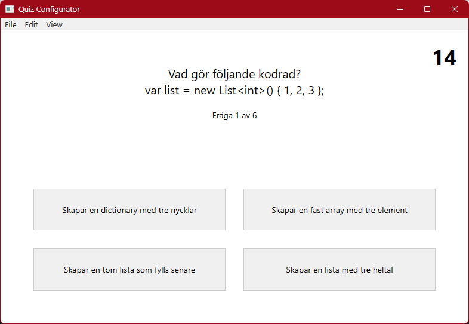
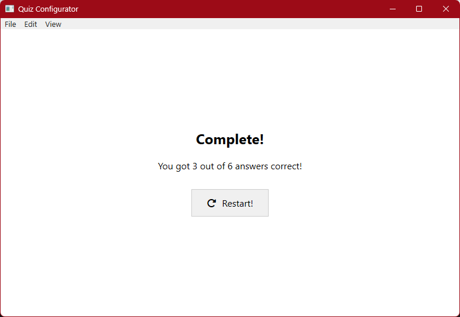
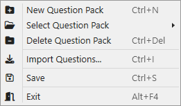
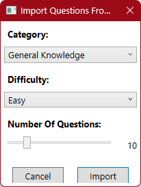
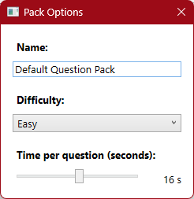

## Labb 3 – Quiz Configurator med MongoDB 
Applikationen är uppdaterad så att **Question Packs + frågor** lagras i **MongoDB** (via `MongoDB.Driver`) istället för i JSON-filer.

Appen använder dessa environment variables om du vill ändra från standard:
- `MONGODB_CONNECTION_STRING` (default: `mongodb://localhost:27017`)
- `MONGODB_DATABASE` (default: **`MelvinEdlund`** – förnamn+efternamn utan mellanslag)

- Vid första körning skapas collections: `questionPacks` och `categories`.
- Om DB är tom seedas `questionPacks` från `Resources/packs.json`.
- Om `categories` är tom seedas några startkategorier (kan hanteras i appen via “Manage Categories…”).

### Uppgift
Programmet är ett WPF-verktyg där användaren kan skapa och redigera frågepaket till ett quiz. Det stödjer import/export av JSON, hämtning av externa frågor via API och är byggt enligt MVVM med DataBinding, Commands och dialogrutor.

### Funktioner
- **Frågehantering:** Skapa, redigera och radera frågor och svar.  
- **Import/Export:** Importera quizpaket från JSON-filer och exportera tillbaka i korrekt struktur.  
- **API-integration:**  
  - Hämtar frågor från ett externt trivia-API (Open Trivia DB eller motsvarande).  
  - API-svaret mappas till interna modeller med DTO-klasser.   
  - Användaren kan förhandsgranska och välja vilka frågor som ska läggas till.  
- **MVVM-struktur:** ViewModels hanterar logik, validering och bindningar till gränssnittet.  

### Screenshots
**Huvudfönster:**  

**Spelfönster:**  

**Importdialog:**  
  
